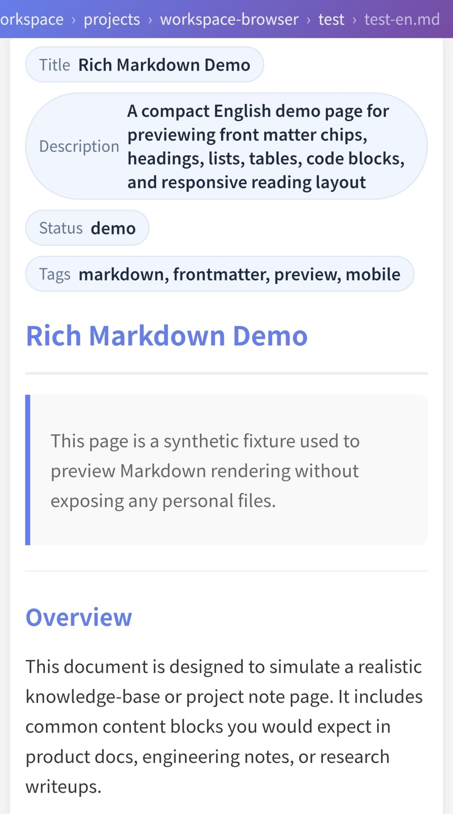

# 🌐 OpenClaw Workspace Browser

**English** | [简体中文](README.zh-CN.md)

A lightweight web-based file browser designed for OpenClaw workspace, providing a web interface to browse local file systems. Features Markdown rendering, direct HTML execution, image previewing, and more.

## Preview



## Features

- 📂 **File System Browsing** - Securely browse all files and folders within a specified directory
- 📝 **Markdown Rendering** - Automatically render Markdown files with syntax highlighting, code blocks, compact Front Matter metadata chips, and auto-linked bare URLs
- 🎮 **HTML Execution** - Run HTML files directly in the browser (great for games and demos)
- 🖼️ **Image Preview** - Inline image preview without downloading
- 📱 **Mobile Friendly** - Responsive design with scrollable breadcrumb navigation
- 🔒 **Basic Authentication** - HTTP Basic Auth protection support
- ⚡ **Lightweight & Fast** - Pure Node.js implementation, no database required

## Installation

```bash
npm install
```

## Configuration

1. Copy the sample configuration file:

```bash
cp config.sample.json config.json
```

`config.json` is intentionally ignored by Git and is expected to remain local to each deployment.

2. Edit `config.json`:

```json
{
  "port": 8888,
  "auth": {
    "user": "your_username",
    "pass": "your_password"
  },
  "baseDir": "~/.openclaw/workspace",
  "pinnedPaths": [
    "projects",
    "research/llm",
    "Notes"
  ],
  "skipNames": [
    "node_modules",
    "__pycache__",
    ".git",
    ".DS_Store"
  ]
}
```

**Configuration Options:**

- `port` - Server port number
- `auth` - HTTP Basic Auth authentication (leave empty to disable authentication)
- `baseDir` - Base directory to browse (supports `~` expansion to home directory)
- `pinnedPaths` - Files, folders, or nested subdirectories to pin at the top of the homepage (for example `research/llm` or `workspace/README.md`)
- `skipNames` - File/folder names to hide during browsing

## Running

Run directly:

```bash
npm start
```

Visit `http://localhost:8888`

## PM2 Management

Run with PM2 daemon:

```bash
# Start
pm2 start src/server.js --name workspace-browser

# Stop
pm2 stop workspace-browser

# Restart
pm2 restart workspace-browser

# View logs
pm2 logs workspace-browser

# Auto-start on system boot
pm2 startup
pm2 save
```

## Usage Examples

### Browsing Files

Visit the homepage to see all pinned folders. Click to navigate into directories.

### Viewing Markdown

Markdown files are automatically rendered with support for:
- Headings, lists, and code blocks
- Tables (with fullscreen view)
- Links and images
- Front Matter displayed as compact metadata chips above the document body
- Bare URLs such as `example.com/path` and `https://foo.dev/bar` (opened in a new tab, with common code-like suffixes such as `.js` and `.ts` excluded)

Supported Front Matter keys for list cards include `title`, `name`, `description`, `desc`, and `summary`.

### Running HTML/JS Files

Any HTML file inside the browsed workspace can be opened directly in the browser. It does not need to live in a special `games/` directory.

### Downloading Files

Click the "Download" button on the file details page, or use the `/__download/path` endpoint to download directly.

## Tech Stack

- **Node.js** - Runtime
- **Express** - Web framework
- **EJS** - Template engine
- **marked** - Markdown parser
- **highlight.js** - Code syntax highlighting

## Security

- Path traversal protection (prevents accessing files outside `baseDir`)
- Basic authentication protection (optional)
- Read-only file system access (no write operations)

## License

MIT License
